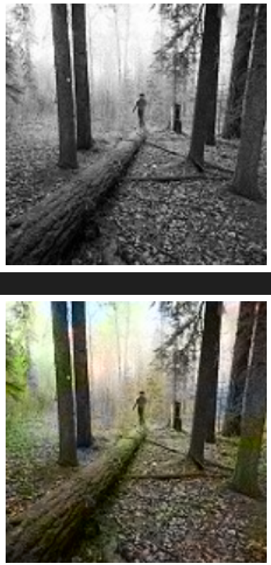
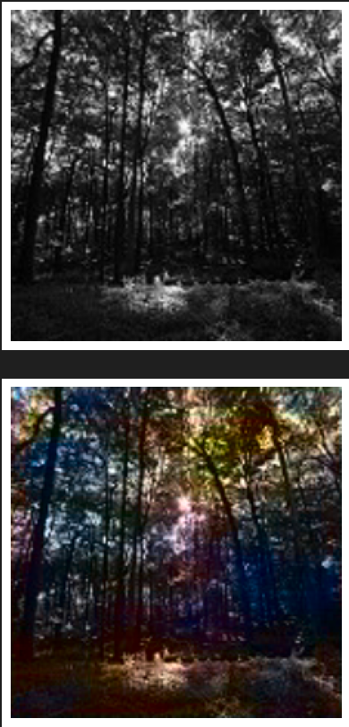
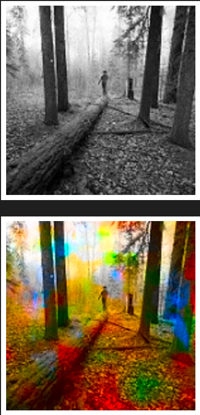
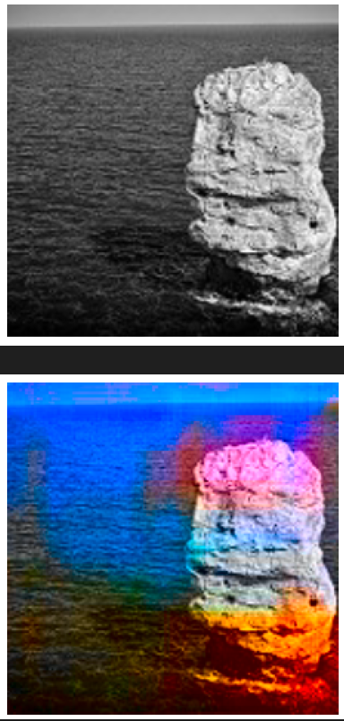

# Image-Coloring-using-Autoencoders-and-Deep-Transfer-Learning

**This Project is Incomplete and will be work in progress**

> [LinkedIn Post for this Project](https://www.linkedin.com/posts/amit-vikram-raj-883460207_github-avr2002image-coloring-using-autoencoders-activity-7089085400996020224-Oulu?utm_source=share&utm_medium=member_desktop)

$\rightarrow$ **Approach**
- I tried using Autoencoders and Transfer Learning for this one. I tried VGG16 and InceptionResNetV2 as an encoder/feature extractor layer and a custom decoder layer.

- Although it was coloring my B/W images, but results were not satisfactory. [See notebooks](https://github.com/avr2002/Image-Coloring-using-Autoencoders/tree/main/notebooks)

- Some great minds have worked on this problem before, like @EmilWallner and Richard Zhang(@rzhang88), both on Twitter. Their approaches were a bit complex to grasp for me, **for now**. So, I decided to give this project some rest.

* **

$\rightarrow$ Sample Outputs

    
    
    
    

* **

$\rightarrow$ This Project was inspired by [Emil Waller](https://github.com/emilwallner)

- [Coloring-greyscale-images](https://github.com/emilwallner/Coloring-greyscale-images)
- [Floydhub Blog - Colorizing B&W Photos with Neural Networks](https://blog.floydhub.com/colorizing-b-w-photos-with-neural-networks/)
- [Emil’s Story as a Self-Taught AI Researcher](https://blog.floydhub.com/emils-story-as-a-self-taught-ai-researcher/)

$\rightarrow$ For fututre references:
- [Kaggle- Image Colorization basic implementation with CNN](https://www.kaggle.com/code/basu369victor/image-colorization-basic-implementation-with-cnn)

- [Richard Zhang- Colorful Image Colorization](http://richzhang.github.io/colorization/)

    - [Github](https://github.com/richzhang/colorization/tree/master)

$\rightarrow$ Serrano Academy
- [Autoencoders](https://youtu.be/DG7YTlGnCEo)
- [Neural Networks & GANs](https://youtube.com/playlist?list=PLs8w1Cdi-zvavXlPXEAsWIh4Cgh83pZPO)

$\rightarrow$ Code Emporium
- [Autoencoders - EXPLAINED](https://youtu.be/7mRfwaGGAPg)
- [Variational Autoencoders - EXPLAINED!](https://youtu.be/fcvYpzHmhvA)